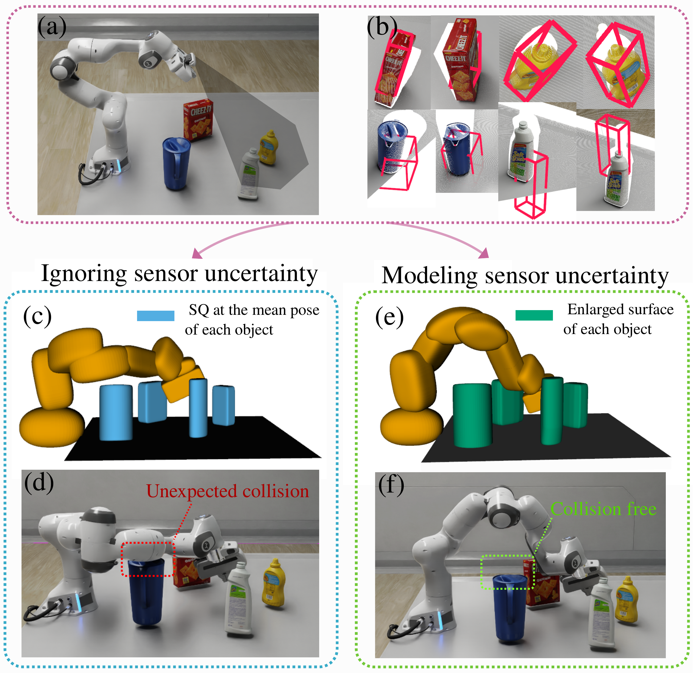

[Xiaoli Wang1](https://github.com/lily983){:target="_blank"}, [Sipu Ruan1](https://ruansp.github.io/){:target="_blank"}, [Xin Meng1](https://github.com/XinnMeng){:target="_blank"}, [Gregory Chirikjian1*](https://cde.nus.edu.sg/me/staff/chirikjian-gregory-s/){:target="_blank"}

1Department of Mechanical Engineering, National University of Singapore, Singapore

*Department of Mechanical Engineering, University of Delaware, USA

Published in __IEEE Robotics and Automation Letters (RA-L)__

## Abstract
Probabilistic collision detection (PCD) is essential in motion planning for robots operating in unstructured environments, where considering sensing uncertainty helps prevent damage. Existing PCD methods mainly use simplified geometric models and address only position estimation errors. This paper presents an enhanced PCD method with two key advancements: (a) using superquadrics for more accurate shape approximation and (b) accounting for both position and orientation estimation errors to improve robustness under sensing uncertainty. Our method first computes an enlarged surface for each object that encapsulates its observed rotated copies, thereby addressing the orientation estimation errors. Then, the collision probability is formulated as a chance-constraint problem that is solved with a tight upper bound. Both steps leverage the recently developed closed-form normal parameterized surface expression of superquadrics. Results show that our PCD method is twice as close to the Monte-Carlo sampled baseline as the best existing PCD method and reduces path length by 30% and planning time by 37%, respectively. A Real2Sim2Real pipeline further validates the importance of considering orientation estimation errors, showing that the collision probability of executing the planned path is only 2%, compared to 9% and 29% when considering only position estimation errors or no errors at all.

## Links
- [Paper](https://arxiv.org/abs/2502.15525){:target="_blank"}
- Code: 
  - C++ library & ROS package: upcoming..
  - [MATLAB implementation](https://github.com/lily983/pcd-matlab){:target="_blank"}: MATLAB version for algorithms. It also includes visualizaions for figures in the paper and benchmark results from C++ implementations.

## Introductory Figure

  

